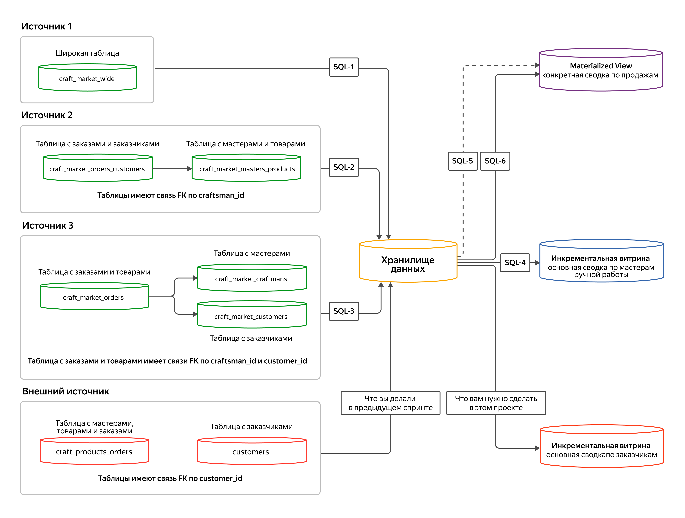

# Проект: добавление нового источника в DWH

Источник: учебное задание Яндекс Практикума по дисциплине "Работа с данными
в хранилище". Перенесено из сохранённой страницы `w.html` и её материалов
`w_files/`, предоставленных 11 сентября 2026 года.

Ниже сохранены учебный текст и описание схемы. Пунктуация приведена к
обычным символам, SQL-примеры вынесены в отдельные файлы по ссылкам в
шагах 3 и 6. SQL-логика примеров сохранена без исправлений. Это исходные
материалы курса; решение проекта будет добавлено в [`../sql/`](../sql/).

Важная особенность корпоративных хранилищ - возможность интегрировать новые источники. В этом проекте вы как раз и добавите новый источник в DWH.

Маркетплейс товаров ручной работы набирает популярность и расширяет свою аудиторию. Чтобы привлечь больше покупателей, приобрели ещё один сайт, который предоставляет похожие услуги. Формальная часть сделки завершена, нужно интегрировать данные купленного сайта в хранилище.

Добавление нового источника - тот же процесс, что и загрузка предыдущих источников: нужно интегрировать данные и построить новую витрину. Вы уже строили инкрементальную витрину с отчётом по мастерам, теперь постройте похожую витрину с отчётом по заказчикам. Она пригодится, чтобы внедрить программу лояльности, изучить интересы пользователей, сделать более релевантной систему рекомендаций товаров и скорректировать маркетинговый план по акциям.

Общая схема проекта выглядит следующим образом:

В центре схемы - хранилище данных. В него через SQL-запросы загружаются данные из нескольких источников. В предыдущем модуле вы загружали из внешнего источника данные таблицы с мастерами, товарами и заказами craft_product_orders и таблицы с заказчиками customers (таблицы имеют связь FK по customer_id). Из источника 1 данные широкой таблицы craft_market_wide попадают в хранилище через первый SQL-запрос. В источнике 2 данные таблицы с заказами и заказчиками craft_market_orders_customers сначала попадают в таблицу с мастерами и товарами craft_market_masters_products (таблицы имеют связь FK по craftsman_id), а затем через второй SQL-запрос - в хранилище. Из источника 3 данные таблицы с заказами и товарами craft_market_orders попадают сначала в таблицу с мастерами craft_market_craftmans и таблицу с заказчиками craft_market_customers (таблица с заказами и товарами имеет связи FK по craftsman_id и customer_id), а затем через третий SQL-запрос попадают в хранилище. Из хранилища данные с помощью четвёртого SQL-запроса выводятся в инкрементальную витрину с основной сводкой по мастерам ручной работы. А также с помощью пятого и шестого SQL-запросов выводятся в Materialized View с конкретной сводкой по продажам. В проекте вам необходимо построить инкрементальную витрину с основной сводкой по заказчикам, поэтому к ней ведёт стрелка из хранилища данных.

Большую часть работы вы сделали, осталось только загрузить данные нового источника в хранилище и построить витрину.

## Инструкция по выполнению

### Шаг 1. Подключение к базе

Вам понадобится та же БД, с которой вы работали в течение всего модуля. Настройки соединения с БД те же. Нужные параметры вы получили во время регистрации в сервисе проверок. Напомним их:

- **Хост** - значение поля `host` из полученных параметров подключения.
- **База данных** - значение поля `dbname` из полученных параметров подключения.
- **Порт** - 6432.
- **Аутентификация** - **Database Native**.
- **Пользователь** - значение поля `user` из полученных параметров подключения.
- **Пароль** - значение поля `password` из полученных параметров подключения.

Обязательно выберите пункт **Сохранять пароль локально**. Это позволит не вводить пароль заново при каждом входе.

Теперь напомним схему подключения, таблицы и модель данных:

- В схеме `dwh` - таблицы измерений для мастеров ручной работы (`d_craftsman`), заказчиков (`d_customer`) и товаров (`d_product`). Также там есть таблица фактов о продажах (`f_order`), инкрементальная витрина по мастерам за отчётные периоды (`craftsman_report_datamart`) и `MATERIALIZED VIEW` с отчётом продаж по всему маркетплейсу (`orders_report_materialized_view`).
- В схеме `source1` - широкая таблица первого источника `craft_market_wide`.
- В схеме `source2` - две ненормализованные таблицы: таблица мастеров и товаров (`craft_market_masters_products`) и таблица заказчиков и заказов (`craft_market_orders_customers`).
- В схеме `source3` - три таблицы: мастеров (`craft_market_craftsmans`), заказчиков (`craft_market_customers`), заказов с товарами (`craft_market_orders`).
- Схема `external_source` - новая. Там как раз находятся таблицы нового источника, которые нужно подключить к хранилищу.

### Шаг 2. Изучение данных нового источника

Изучите данные в источнике. Там указаны две таблицы: в одной данные по мастерам, товарам и заказам (`craft_products_orders`), а в другой - только по заказчикам (`customers`). Правильно разложите данные по измерениям в хранилище. Сделайте это так же, как вы делали в первом модуле.

Данные новой схемы `external_source` должны оказаться в `dwh` в таблицах измерений и фактов.

### Шаг 3. Напишите скрипт переноса данных из источника в хранилище

Загрузка данных из нового источника - операция не на один раз: какое-то время сайт всё ещё будет существовать, пока не будет выполнен ребрендинг. А это значит, что данные из источника нужно постоянно забирать и собирать в хранилище.

Данные должны попасть в схему `dwh` по тому же принципу, что и из схем `source1`, `source2`, `source3`. Дополните скрипт загрузки данных из старых источников новым источником.

Если нужно, изучите скрипт загрузки из старых источников.

Скрипт загрузки из старых источников

[Полный SQL-пример из задания](./reference-sql/01-load-existing-sources.sql).

### Шаг 4. Изучите потребности бизнеса в новой витрине

Изучите постановку задачи от бизнес-аналитика и исследуйте хранилище на соответствие данных. Посмотрите, какие данные понадобятся для создания DDL новой витрины.

Бизнесу требуются следующие данные:

- идентификатор записи;
- идентификатор заказчика;
- Ф. И. О. заказчика;
- адрес заказчика;
- дата рождения заказчика;
- электронная почта заказчика;
- сумма, которую потратил заказчик;
- сумма, которую заработала платформа от покупок заказчика за месяц (10% от суммы, которую потратил заказчик);
- количество заказов у заказчика за месяц;
- средняя стоимость одного заказа у заказчика за месяц;
- медианное время в днях от момента создания заказа до его завершения за месяц;
- самая популярная категория товаров у этого заказчика за месяц;
- идентификатор самого популярного мастера ручной работы у заказчика. Если заказчик сделал одинаковое количество заказов у нескольких мастеров, возьмите любого;
- количество созданных заказов за месяц;
- количество заказов в процессе изготовки за месяц;
- количество заказов в доставке за месяц;
- количество завершённых заказов за месяц;
- количество незавершённых заказов за месяц;
- отчётный период, год и месяц.

### Шаг 5. Напишите DDL новой витрины

Напишите DDL для витрины, определив типы, названия полей и комментарии. Учитывайте, что витрина должна быть инкрементальной: понадобится дополнительная таблица с датой загрузки данных.

Витрину назовите `dwh.customer_report_datamart`. Возьмите за основу витрину по мастерам ручной работы. Новая витрина и витрина по мастерам будут во многом схожи.

### Шаг 6. Напишите скрипт для инкрементального обновления витрины

Напишите скрипт, который будет выполнять расчёт для новой витрины. Это инкрементальная витрина, значит, и расчёт должен быть инкрементальным. За основу можно взять скрипт обновления инкрементальной витрины по мастерам.

Скрипт обновления витрины по мастерам

[Полный SQL-пример из задания](./reference-sql/02-craftsman-report-datamart.sql).

Чтобы получить идентификатор самого популярного мастера у заказчика, можно попробовать написать ещё один `INNER JOIN` по аналогии с определением самой популярной категории товаров. Самый популярный мастер определяется по количеству заказов от заказчика. Если заказчик сделал одинаковое количество заказов у нескольких мастеров, возьмите идентификатор любого. Для этого воспользуйтесь [командами](https://www.postgresql.org/docs/current/functions-window.html) `DISTINCT ON (COLUMN)` или `FIRST_VALUE`. Или же можно вместо оконной функции `RANK()` воспользоваться оконной функцией `ROW_NUMBER()`.

## Как будут проверять мой проект

На что обращают внимание при проверке проектов:

- логично ли написаны SQL-запросы;
- выбраны ли эффективные типы данных в DDL;
- нет ли аномалий, дублей или пропусков в данных.

Всё необходимое для того, чтобы выполнить проект, есть в темах, которые вы прошли.

Успехов!
